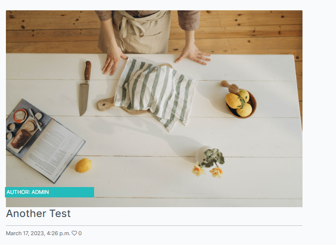

# USER STORY TESTING

 ### As a Site User I can  access an individual post  so that I can see the details clearly

  -  

 ### As a Site User I can  create a post at the click of a button * so that I can easily contribute to the site

### As a Site User I can like or unlike posts so that I can interact with the content

### As a Site User I can comment on posts so that I can be involved in other users content

### As a Site User I can sign up with an email and password so that I can gain access to the blog site

### As a Site User I can logout of the site  so that I can ensure that my account is safe if I use multiple devices

### As a Site User I can login  so that I can have secure access to the site

### As a Site User I can view a list of recipes  so that I can choose one to open

  -  

### As a Site User/ Admin I can view the number of likes on each post so that I can see which posts are most popular.

### As a Site Admin I can ** approve or disapprove comments ** so that ** I can filter out objectionable comments**

### As a Site User/Admin I can view comments on an individual post so that I can read the conversation

### As a Site User I can create and save drafts so that I can submit them later

### As a Site Admin I can create, read, update and delete posts so that I can manage my blog content

## Manual Testing

  | Feature | Description     | Expected Result |    Actual Result   | Pass/Fail | Comments |
|----------|-----------|-----------|----------------|---------|----------|
|Navbar| Login button navigates to Signin page   |    On click user Sign in Page is shown   |      As expected     |   PASS  |   N/A   |
|Navbar| Sign in Page renders succesfully   |    User can enter in login details  |      As expected     |   PASS  |   N/A   |
|Sign in| Onced signed in User is directed to the home page   |    Home page renders successfully |      As expected     |   PASS  |   N/A   |
|Navbar(Logged in)| Logout button navigates to sign out page   |    Log out page renders successfully   |      As expected     |   PASS  |   N/A   |
|Sign out| Sign out warning modal requires user to confirm sign out  |    Signout modal and button renders succesfully |      As expected     |   PASS  |   N/A   |
|Sign out| Sign out buttons signs user out and redirects to home page  |    User is signed out and redirected to home page |      As expected     |   PASS  |   N/A   |
|Home page (Logged out)| Home page is rendered as a logged out user with prompts to sign up/sign in  |    Home page displays all features for a logged out user   |      As expected     |   PASS  |   N/A |
|Home Page| Sing up button directs user to a page to register as a site user  |    Sign up page rendered successfully   |      As expected     |   PASS  |   N/A   |
|Home Page| Log in button directs user to a page to sign in Page   |    Sign in page rendered successfully   |      As expected     |   PASS  |   N/A   |
|Sign up Page| Form to register as a site user is displayed and working  |    Sign up Form renders successfully and creates a user account once completed  |      As expected     |   PASS  |   N/A   |
|Navbar(Logged out)| Register button is present and navigates to the sign up page once clicked  | Sign up Page renders successfully  |     As expected     |   PASS  |   N/A   |
|Navbar(Logged out)| Expert Recipe is present in navbar and navigates to the Expert recipes page once clicked | Expert Recipe Page renders successfully  |     As expected     |   PASS  |   N/A   |
|Expert Recipe Page| User can see all the 'Expert' recipes posted by Admin  | Admin posts are rendered successfully and are clickable  |     As expected     |   PASS  |   N/A   |
|Expert Recipe Detail| User can see the 'Expert' recipe detail posted by Admin  | Admin posts are rendered successfully and are visible  |     As expected     |   PASS  |   Some features such as ratings and more in detail instructions to be implemented at a later date   |
|Expert Recipe Page| Non Admin Users can comment on expert recipes  | Users can comment and submit the comment for admin approval  |     As expected     |   PASS  |   N/A   |
|Expert Recipe Page|  Non Admin Users can like expert recipes | Users can click the heart button to like the recipe |     As expected     |   PASS  |   N/A   |
|Navbar(Logged in)| Public Recipes are visible and direct user to Public posts page once clicked   |    Public recipes page renders successfully   |      As expected     |   PASS  |   N/A   |
|Public Recipe Page| User can see all the Public recipes posted by Users and Admin  | Posts and submit post button are rendered successfully and are clickable  |     As expected     |   PASS  |   N/A   |
|Public Recipe Detail| User can see the Public recipe detail posted by Users and Admin  | Post details and edit and delete buttons are rendered successfully and are clickable  |     As expected     |   PASS  |   N/A   |
|Public Recipe Detail (CRUD)| User can delete their own Public recipe using the delete button  | Post details are deleted and user is redirected to the public recipe page |     As expected     |   PASS  |   N/A   |
|Public Recipe Detail (CRUD)| When edit button is clicked User is directed to the edit form  |  Edit form is rendered successfully  |     As expected     |   PASS  |   N/A   |
|Edit Recipe Form (CRUD)| User is able to edit their own post   |   User can edit recipe details and save. User is then redirected to the Public Recipes page |     As expected     |   PASS  |   N/A   |
|Submit Recipe Form (CRUD)| User is able to create a recipe   |  Recipe is created, and visible on public recipes page once all data has been inputed and submit a recipe button is clicked |     As expected     |   PASS  |   N/A   |
Submit Recipe Form| Cancel button redirectes the user to the home page   |  Home page is rendered succesfully |     As expected     |   PASS  |   N/A   |

## Resposive Design

Site is responsive from testing completed on [responsive design checker](https://responsivedesignchecker.com/)

## Validator Testing

### HTML

All HTML pages were run through the [W3C HTML Validator](https://validator.w3.org/). See results in below table.

| Page                 | Logged Out | Logged In |
|----------------------|------------|-----------|
| base.html            | No errors  | No errors |
| index.html           | No errors  | No errors |
| recipe_detail.html   | No errors  | No errors |
| recipe_posts.html   | No errors  | No errors |
| submit_recipe.html   | N/A        | No errors |
| submission_detail.html   | No errors  | No errors |
| edit_sub.html     | N/A        | No errors |
| user_submissions.html| No errors  | No errors |

## Python

Pycodestyle was installed to validate the python code written.

- All code has been validated with no errors present.
- Settings.py file has 5 'line too long' errors which are constant with the use of django.

| App       | Models.py |    Forms.py    | Urls.py | Views.py |
|-----------|-----------|----------------|---------|----------|
| Cookbook  |    PASS   |      PASS      |   PASS  |   PASS   |
| FoodDiary |    N/A    |      N/A       |   PASS  |   N/A   |

## Lighthouse Performance

